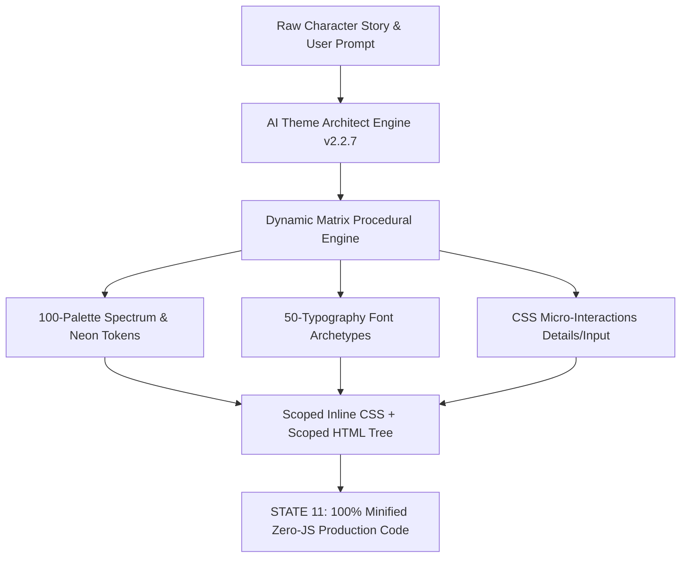

# 🏛️ Architecture & Design Specification: Rubii Card Architect (DESIGN.md)

> **Document Version:** 2.2.7  
> **Engine:** Rubii Express Theme Architect (Transparent & Glowing Frame Edition)  
> **Target Environment:** Mobile Browsers, WebView Embedded Clients, and Rubii App Custom Code Containers

---

## 1. Architectural Philosophy & Zero-JS Directives

Rubii Card Architect is engineered under strict constraints to guarantee 100% platform portability, maximum rendering speed, and zero script injection vulnerabilities.



### 🔒 Core Runtime Constraints
1. **Zero JavaScript Execution:**
   - All interactive state toggles (Tabs, accordions, content reveal) are driven purely by native HTML semantic mechanisms:
     - Primary: `<details>` and `<summary>`
     - Secondary: Invisible `input[type='radio']` + `label` with `:checked` pseudo-class
   - `<script>` tags, inline event handlers (`onclick`, `onload`), and `javascript:` URIs are strictly banned.
2. **Strict Mobile-First Viewport Bounds:**
   - Cards are constrained to a mobile viewport between **320px and 440px**:
     ```css
     width: 100vw;
     max-width: 440px;
     margin: 0 auto;
     box-sizing: border-box;
     ```
3. **Fluid Scaled Typography:**
   - Absolute font sizes (`px`) for content text are forbidden in favor of viewport-fluid mathematical scaling:
     ```css
     font-size: clamp(8px, 3.5vw, 14px); /* Body & metadata */
     font-size: clamp(18px, 5.0vw, 28px); /* Card Title / Name */
     ```
4. **Copyable Text Node Integrity:**
   - All biographical, relationship, and stat content must live inside rendered HTML text nodes with `user-select: text !important;`. Hiding text inside CSS `::before` or `::after` content attributes is forbidden.
5. **CSS Override Resilience:**
   - Inline styles enforce `!important` and single quotes (`'`) to triumph over host application stylesheet cascades.

---

## 2. Visual Theme & Token Architecture

The v2.2.7 engine establishes the **Transparent & Frame Architecture**, transitioning from opaque solid card backgrounds to lightweight translucent layered glass:

```html
<div style="--neon-p:#00FFFF; --neon-s:#FF00AA; --neon-accent:#39FF14; --custom-bg:rgba(10,10,12,0.75);">
```

### Token Definitions

| CSS Variable | Role | Example |
| :--- | :--- | :--- |
| `--neon-p` | **Primary Neon Glow:** Outer borders, title text-shadow, active tabs | `#00FFFF`, `#FF0055`, `#D4AF37` |
| `--neon-s` | **Secondary Contrast:** Subtitles, category tags, divider gradient stops | `#FF00AA`, `#00BFFF`, `#A78BFA` |
| `--neon-accent`| **Highlight Indicator:** Glowing status dots, key badges, stat gauge fill | `#39FF14`, `#FFD700`, `#FF66C4` |
| `--custom-bg` | **Hybrid Canvas:** Translucent surface background with optional backdrop blur | `rgba(12,10,20,0.8)` |

### Neon Glow & Frame Implementation
```css
border: 2px solid var(--neon-p) !important;
box-shadow: 0 0 12px var(--neon-p), inset 0 0 8px rgba(0,0,0,0.4) !important;
background: var(--custom-bg) !important;
backdrop-filter: blur(4px);
```

---

## 3. Dynamic Matrix Procedural System

To eliminate repetitive UI layouts across character profiles, the engine dynamically synthesizes combinations from 4 decoupled vectors:

```
[ Hybrid Generation Matrix ] = [ Color Palette ] × [ Typography Archetype ] × [ Surface/Mask ] × [ UI Component ]
```

1. **The Pure Element:** Archetypal match according to story genre (e.g. Classic Vampire -> Blood Oath).
2. **The Hybrid Cross-Over:** Intentional intersection of divergent themes (e.g. Cyberpunk + Gothic Victorian = *Cyber-Gothic*).
3. **The Atmospheric Variant:** Overlays environmental filters (e.g. CRT scanlines, paper grain, bioluminescence).
4. **The Wildcard Avant-Garde:** High-contrast experimental layout combinations.

---

## 4. Master Databases Overview

### 🎨 100-Palette Categorization
The first 50 entries remain in their original order. Entries 51–100 are a dated snapshot of named palettes shown on [Coolors Trending](https://coolors.co/palettes/trending) on 2026-09-24, grouped into the same five categories. Their full Hex arrays, including five to ten colors where provided, are preserved in the master data.
* **1. Minimal & Modern (1–10):** Soft stone, Nordic frost, quiet luxury, editorial espresso.
* **2. Tech, SaaS & Corporate (11–20):** Electric pulse, cyan cloud velocity, banking mint, fintech amethyst.
* **3. Dark Mode & Cyberpunk (21–30):** Carbon mint, Tokyo vaporwave, acid neon forest, space noir.
* **4. Pastel & Sweet (31–40):** Digital peach, 90s cold purple, sakura garden, lilac cream.
* **5. Bold, Earthy & Retro (41–50):** Deep plum cherry, Mediterranean tan, terra-cotta, matcha café.

### ✍️ 50-Typography Matrix
* **Historical & Academic (A1–A5):** Eternal Serif, Dark Academia, Victorian Steampunk, Oriental Heritage.
* **Cosmic & Sci-Fi (A6–A10):** Neo-Cyber Grid, Brutalist Mainframe, Retro-Futurism, Solarpunk.
* **Luxury & Noir (A11–A15):** Editorial Luxury, Silent Luxury, Hard-Boiled Detective, Syndicate Underworld.
* **Horror & Supernatural (A16–A20):** Psychological Dread, Folk Horror, Found Footage, Lovecraftian Abyssal.
* **Organic & Pop (A21–A30):** Cottagecore, Coastal Nomad, Indie Cinema, K-Pop Pop-Art.
* **Military & Action (A31–A35):** Military Bunker, Post-Apocalyptic Wasteland, E-Sports Arena.
* **Surreal & Hybrid (A36–A50):** Dreamcore, Cyber-Gothic, Acid Graphics, Scandinavian Minimal.

---

## 5. Motion Performance Budget

To prevent frame drops on mobile devices:
* **Layer Budget:** Maximum of **5 simultaneous active composite layers**.
* **Permitted CSS Properties for `@keyframes`:**
  - `transform: translate() / scale() / rotate()` (Hardware GPU Accelerated)
  - `opacity: 0.0 -> 1.0`
  - `box-shadow` / `text-shadow` (Controlled radius $\le 16\text{px}$)
* Heavy `filter: blur()` loops and complex particle calculations are strictly banned in runtime.

---

## 6. Output Generation Pipeline (STATE 11)

```
[Turn 1: Analysis & Dossier] ➡️ [Turn 2: Design Manifest] ➡️ [STATE 11: Minification Filter] ➡️ [1-Line HTML Output]
```

In STATE 11, the engine strips:
* All leading and trailing whitespace
* All newline characters (`\n`, `\r`)
* All CSS/HTML code comments (`/* ... */`, `<!-- ... -->`)

Producing a compact, lightweight code bundle ready for instantaneous paste into mobile application code fields.
